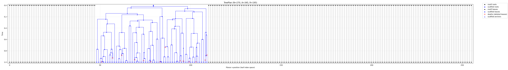

# Varco: Variable Cogeneration

Varco is a ~ research prototype exploring **variable-length** motif scaffolding, using an auxiliary process adapted from **Branching Flows**: a generative process where elements can *appear* (via splits/birth events) and *disappear* (via deletion events) over continuous time.  The auxiliary process can be seen as an extension the auxiliary process of **Edit Flows** (in discrete space) to allow insertions / deletions across multiple domains,  while still supporting flow-matching style training and sampling

Varco uses the same co-generation modalities as Cogeneration (sequence + structure), but adds a branching process to handle length changes. We also limit to motif scaffolding.

This subproject reuses many of the components of cogeneration; the model warm-starts using a cogeneration checkpoint, and effectively learns the insertion/deletion dynamics through fine-tuning.

## Branching Process

A `TreePlan` auxiliary process is generated for each data sample. The tree is used to corrupt the sample time time `t`; the model never sees the tree. 

The tree defines:
- which nodes are leaves, or the motifs, etc.
- a binary tree coalescing leaves into root nodes, with "anchors" which are "split" over time
- addititional nodes marked to-be-deleted
- which nodes are present at any given time, and their positional ordering

Corruption requires some amount of sampling. However, we can construct a brownian bridge between split events root -> anchor -> leaf, rather than sampling over discretized time. We also batch the tree by depth, and sample across each depth simultaneously. Thus, arriving at the corrupted state at time `t` only requires O(depth) sampling steps, 

Sampling is still performed over N timesteps, with the addition that we sample a split and deletion hazard and nodes may be added / removed over the process.

### Examples

This graphic illustrates a TreePlan for a single scaffold.

t=0 on top, t=1 on bottom. Motifs are in grey; they do not split or delete, and the sequence is fixed, but they are interpolated in space. 

1 root appears at t=0. "anchors" are split at intermediate time points. Deleted nodes are marked by a red square.

  

See the [corruption animation](media/example_corruption.mp4), which shows a trajectory from t=0 to t=1 for translations, rotations, and sequence.

## Running

Varco uses Hydra structured configs registered in `varco/config.py`.

- **Training** (runs the training entrypoint in `varco/train.py`):
  - `python -m varco.train`

- **Prediction** (loads a checkpoint and runs `Trainer.predict`):
  - `python -m varco.predict inference.ckpt_path=varco/ckpt/epoch0_len512_step74000.ckpt`

Varco depends on the same environment setup as the main repository; follow `installation.md` for installation and data setup.

## Attribution

This subproject is inspired by Branching Flows https://arxiv.org/abs/2511.09465 (only available in Julia)